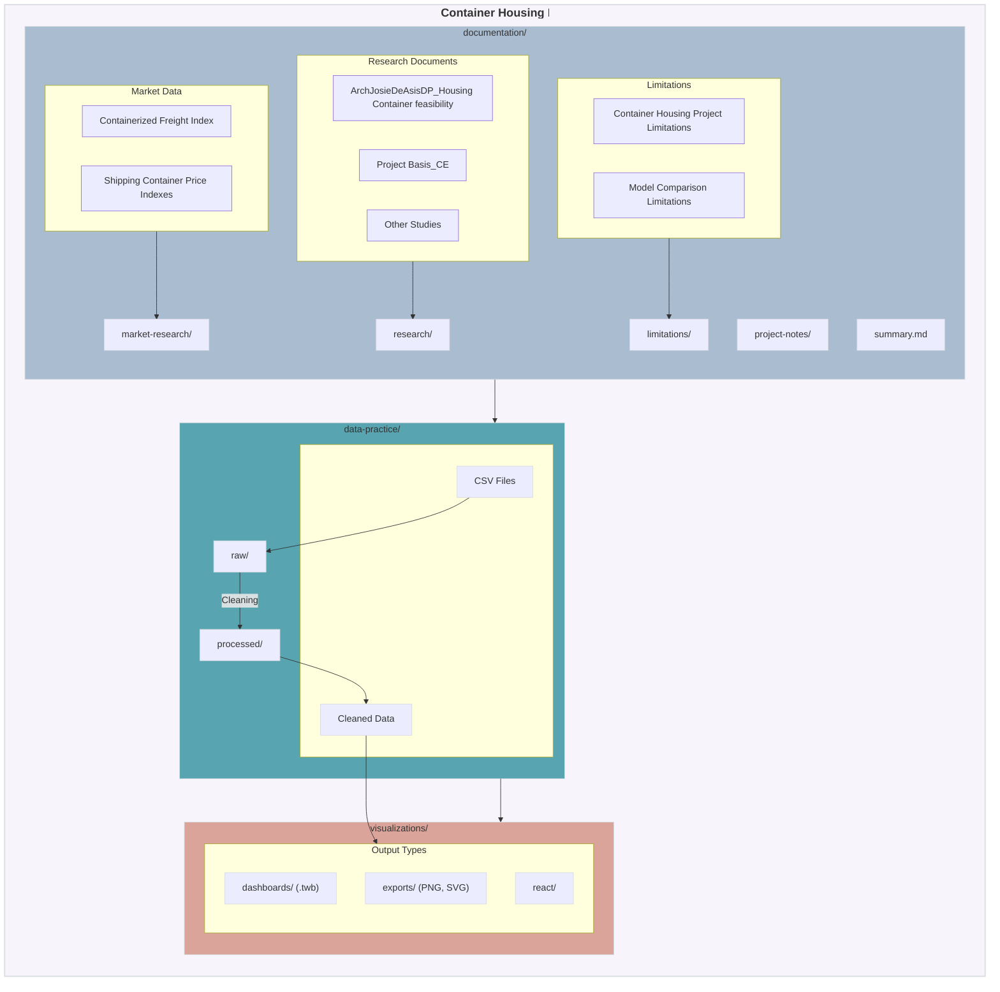

# Project Flowchart

```mermaid
flowchart TD

    subgraph project["Container Housing Project"]
        direction TB

        subgraph data["data-practice/"]
            direction TB
            raw["raw/"]
            proc["processed/"]

            subgraph data_box[" "]
                direction LR
                csvs["CSV Files"]
                cleaned["Cleaned Data"]
            end

            raw --> |"Cleaning"| proc
            csvs --> raw
            proc --> cleaned
        end

        subgraph docs["documentation/"]
            direction TB
            research["research/"]
            market["market-research/"]
            limits["limitations/"]
            notes["project-notes/"]
            summary["summary.md"]

            subgraph research_docs["Research Documents"]
                arch["ArchJosieDeAsisDP_Housing Container feasibility"]
                ce10["Project Basis_CE"]
                other["Other Studies"]
            end

            subgraph market_docs["Market Data"]
                freight["Containerized Freight Index"]
                prices["Shipping Container Price Indexes"]
            end

            subgraph limitations_docs["Limitations"]
                project_limits["Container Housing Project Limitations"]
                model_limits["Model Comparison Limitations"]
            end

            market_docs --> market
            research_docs --> research
            limitations_docs --> limits
        end

        subgraph viz["visualizations/"]
            direction TB

            subgraph outputs["Output Types"]
                direction TB
                dashboards["dashboards/ (.twb)"]
                exports["exports/ (PNG, SVG)"]
                react["react/"]
            end

            cleaned --> outputs
        end

        docs --> data
        data --> viz
    end

    style project fill:#f7f5fb,stroke:#D8DBE2,stroke-width:2px
    style project text:#11111,font-size:20px,font-weight:bold

    style data fill:#58A4B0,stroke:#D8DBE2,stroke-width:1px
    style docs fill:#A9BCD0,stroke:#D8DBE2,stroke-width:1px
    style viz fill:#DAA49A,stroke:#D8DBE2,stroke-width:1px


    style raw fill:#,stroke:#D8DBE2,stroke-width:1px
    style proc fill:#,stroke:#D8DBE2,stroke-width:1px
    style csvs fill:#,stroke:#D8DBE2,stroke-width:1px
    style cleaned fill:#,stroke:#D8DBE2,stroke-width:1px
    style research fill:#,stroke:#D8DBE2,stroke-width:1px

    style market fill:#,stroke:#D8DBE2,stroke-width:1px
    style limits fill:#,stroke:#D8DBE2,stroke-width:1px
    style notes fill:#,stroke:#D8DBE2,stroke-width:1px
    style summary fill:#,stroke:#D8DBE2,stroke-width:1px
    style dashboards fill:#,stroke:#D8DBE2,stroke-width:1px
    style exports fill:#,stroke:#D8DBE2,stroke-width:1px
    style react fill:#,stroke:#D8DBE2,stroke-width:1px

```

// dun wanna make this pretty it is what it is
